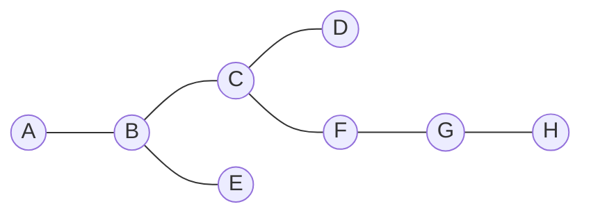
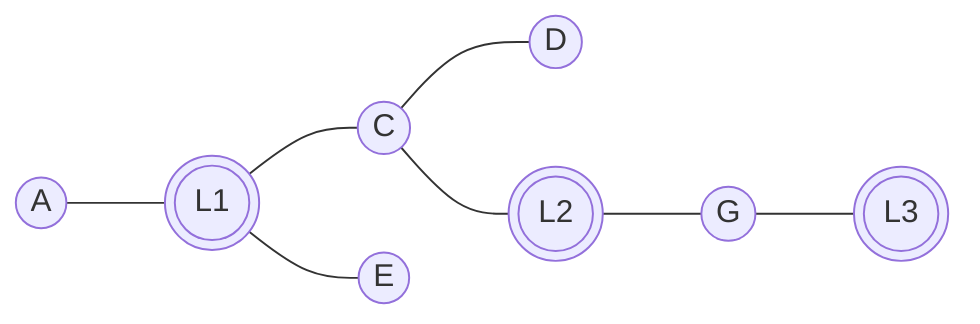
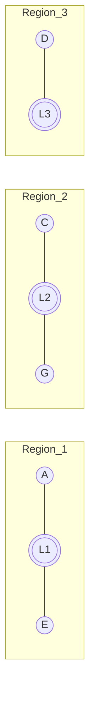
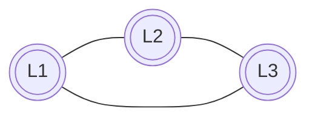
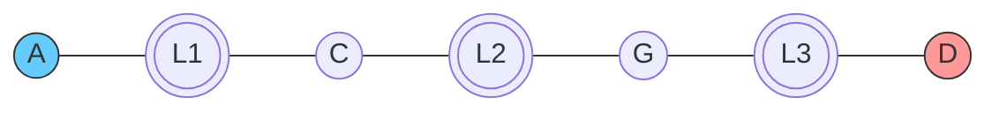

# ALP (A*, Landmarks, and Polygon Inequalities)
## Author: Newton Campbell

ALP (A* with Landmarks and Polygon Inequalities) is a shortest-path acceleration method designed for **very large graphs**—the kind where classical Dijkstra’s algorithm becomes too slow and where memory-heavy preprocessing methods like ALT struggle to scale. ALP improves the speed of exact shortest-path queries by giving A* a far stronger sense of “direction” through the graph, allowing it to explore only a tiny portion of the network while still guaranteeing optimal answers.

ALP is meant for situations where:

* The graph is extremely large (millions of vertices or more),
* Exact shortest paths are required,
* Preprocessing must remain memory-efficient,
* And high-performance per-query response is needed.

Developers often approach shortest path problems through Dijkstra’s algorithm. This works on small graphs. It slows down on graphs with millions of nodes. ALP gives A* the information it needs to move through large graphs intelligently. The idea is that A* receives guidance so it does not wander aimlessly.

Take for example, the diagram below:



Imagine that this small picture is one tiny corner of a very large graph. Our goal is to guide A* across the graph without storing enormous landmark tables.

We start by placing a few landmarks. These are special vertices that act like reference points. They allow us to describe the shape of the graph without holding too much data.



The graph now has three landmarks. Each landmark will own a region of the graph. This ownership step is the beginning of ALP’s space savings. We assign each node to the landmark that is closest to it.



Each region now has its landmark. ALP stores only one distance per node. The distance goes from the node to the landmark that owns it. This replaces the large ALT matrix with a compact partition. The saving becomes enormous on graphs with millions of nodes.

Once we have communities and local regions, we look at the global structure. We compute distances between landmarks. That global structure is stored in a very small matrix. It captures how far apart the regions are.



This miniature triangle is the coarse map of the entire graph. It gives ALP the ability to understand long range structure even though it stores almost nothing per node.

Now that we have the local structure and the global structure, ALP builds a search heuristic. A* uses this heuristic to decide which node to examine next. The heuristic uses triangle inequalities and polygon inequalities. These inequalities give A* a valid lower bound on how far a node is from the target.

To see this intuitively, imagine a search from A to D.



A* wants to know which direction to explore. ALP gives A* a lower bound on the remaining distance to the target. The bound grows stronger as the regions become more separated. The global structure stored in the landmark matrix tells A* which regions lie between the source and the target. The local distances inside each region tell A* where it sits within the region. The polygon inequalities connect these two pieces together so the search becomes highly focused.

In practice, ALP can provide **orders-of-magnitude speedups** over classical methods while using a fraction of the memory required by other preprocessing techniques. This makes it ideal for large-scale transportation networks, routing, gaming environments, knowledge graphs, communication networks, and any domain where the same graph is queried many times for exact distances.


## Requirements

- Python 3.11+ (tested)
- NetworkX (graph data structures, Dijkstra/A*)
- pytest (for running the test suite)
- Optional: igraph, MySQLdb, memory_profiler, and other deps used by legacy scripts in `archive/`

## Project structure

- `src/alp/`: library code
  - `core.py`: public ALP API and preprocessing
  - `landmarks.py`: landmark selection strategies
  - `partitioning.py`: graph Voronoi ownership
  - `embedding.py`: local and pairwise landmark distances
  - `heuristic.py`: ALP/ALT heuristic construction
  - `astar.py`: A* wrapper using the ALP heuristic
  - `__init__.py`: exports the high-level API
- `tests/`: parity tests against NetworkX (`pytest`)
- `examples/`: small runnable demos
- `archive/`: legacy experiment scripts (Python 2 era); see imports note below
- `docs/`: documentation stubs and notes

## Testing and experiments

- Run unit tests (parity checks vs NetworkX):
  ```bash
  python -m pytest
  ```

- Quick smoke test using the public API:
  ```python
  import networkx as nx
  from alp import alp_preprocess, alp_shortest_path, alp_shortest_path_length

  G = nx.grid_2d_graph(3, 3)  # small 3x3 grid
  alpG = alp_preprocess(G, num_landmarks=3)
  path = alp_shortest_path(alpG, (0, 0), (2, 2))
  length = alp_shortest_path_length(alpG, (0, 0), (2, 2))
  print(path, length)
  ```

- Legacy experiment scripts remain under `archive/`. Update their imports to pull from the library API:
  ```python
  from alp import alp_preprocess, alp_shortest_path, alp_shortest_path_length
  ```
  Then execute the script directly, for example:
  ```bash
  python archive/path_planning.py
  python archive/dataset_characterization.py
  ```

---

## Deep Dive on ALP

In a weighted graph $G = (V,E)$ endowed with a path metric $d(\cdot,\cdot)$, the computation of exact shortest paths traditionally proceeds via Dijkstra's algorithm, which explores vertices in order of increasing tentative distance from a source. The performance bottleneck is not the asymptotic complexity but the geometric myopia: the algorithm cannot know in advance which parts of the graph are irrelevant to the geodesic between two specific vertices. A* addresses this by introducing a function $h(v)$ satisfying $0 \le h(v) \le d(v,t)$, where $t$ is the target. If such an admissible heuristic gives a reasonably sharp lower bound, A* prunes large swaths of the graph without affecting optimality. The challenge is to construct a function that can be computed in constant time yet retains enough geometric information about the global structure of the graph to be meaningfully predictive.

ALT (A*, Landmarks, and Triangle inequalities) provides one of the earliest practical answers to this challenge. It selects a small landmark set $\Lambda$ and precomputes $d(\ell, v)$ for every $\ell \in \Lambda$ and every vertex $v \in V$. During search, ALT uses the triangle inequality $|d(\ell, t) - d(\ell, v)| \le d(v, t)$ to define a lower bound $h(v) = \max_{\ell \in \Lambda} |d(\ell, t) - d(\ell, v)|$. Because all distances are precomputed, evaluating $h$ is $O(|\Lambda|)$ and requires only table lookups. ALT can dramatically reduce search effort compared to plain Dijkstra, but its memory footprint is $O(|V|\cdot|\Lambda|)$ and the quality of its bounds depends on having landmarks that are well placed relative to both $s$ and $t$—a requirement that can be hard to guarantee in heterogeneous graphs.

The ALP method builds on this by combining three ideas: landmark-based embeddings, metric polygon inequalities, and a preprocessing stage that uses community detection to adapt the embedding to the intrinsic large-scale organization of the graph. The role of landmarks is classical: choose a small set $\Lambda = \{\ell_1, \ldots, \ell_L\} \subset V$, compute distances $d(\ell_i,v)$ for vertices $v$, and apply inequalities of the form $|d(\ell_i,t) - d(\ell_i,v)| \le d(v,t)$ to obtain admissible heuristics. This forms the basis of earlier methods such as ALT, but ALP takes the idea further in a way tailored to large networks where structure is far from homogeneous.

A key observation is that many real-world networks naturally decompose into communities — subgraphs with dense internal connectivity and relatively few edges that span between them. In social networks this corresponds to tightly-knit social circles; in transportation networks to geographic regions; in power grids to modular subcomponents. From a metric perspective, distances inside communities tend to be short, while transitions between communities contribute most of the “large-scale geometry” of the graph. ALP incorporates this observation by using community detection during preprocessing to determine a partition of $V$ into regions that reflect intrinsic organization. A variety of algorithms may be used—Louvain, Leiden, spectral partitioning, modularity maximization, or even simple flow-based heuristics—but the purpose is the same: assign each vertex $v$ to a community $C_k$, and then select a single landmark $\ell_k\in C_k$ to serve as the reference point for that entire region.

This partitioning transforms the full landmark embedding into a **distributed embedding**. Instead of storing the full table $d(\ell_i,v)$ for all landmarks $i$ and all vertices $v$, ALP stores only the distances from the landmark $\ell_k$ of community $C_k$ to the members of $C_k$. In other words, each vertex has one “owner” landmark, the representative of its community. Because the number of communities is typically far smaller than the number of vertices, and because each vertex stores only its distance to a single landmark, the memory requirement drops from $O(|V|L)$ to $O(|V| + L^2)$: linear in the graph size plus a small quadratic term in the number of communities. The $L^2$ term comes from storing all-pairs distances between landmarks, which encode the “coarse” geometry that holds communities together.

This organization has a geometric interpretation: the graph is decomposed into metric cells, each with its own coordinate system, and the landmark–landmark matrix encodes the distances between these coordinate origins. The resulting representation resembles a hybrid between a Voronoi diagram and a low-dimensional nonlinear embedding. The community detection step ensures that these regions respect natural graph bottlenecks. For instance, in a road network partitioned by urban neighborhoods, the representative of each neighborhood acts as the anchor for local distances, while the landmark graph captures the inter-neighborhood structure of major roads.

Once the embedding is established, ALP constructs its heuristic through polygon inequalities. Classical ALT heuristics rely solely on triangle inequalities, but ALP examines configurations involving two landmarks—typically the “owner” landmarks of the source and target—and forms quadrilateral inequalities. If $\ell_s$ and $\ell_t$ are the landmarks owning $s$ and $t$, and one considers the quadruple $(\ell_s, s, v, t)$ or $(\ell_s, v, t, \ell_t)$, the triangle inequality applied in suitable decompositions leads to inequalities such as

$$
d(v,t) \ge |d(\ell_s,t) - d(\ell_s,v)|,
\qquad
d(v,t) \ge |d(\ell_t,s) - d(\ell_t,v)|.
$$

and more significantly,

$$
d(v,t) \ge d(\ell_s, \ell_t) - d(\ell_s,v) - d(\ell_t,t),
\qquad
d(v,t) \ge d(\ell_s, \ell_t) - d(\ell_s,s) - d(\ell_t,v).
$$

These are all admissible because they follow directly from the metric axioms. Their power lies in the fact that communities often serve as metric “convex” regions: vertices in a community tend to be close to their representative landmark, and vertices in different communities tend to reflect the inter-community distances encoded in the landmark matrix. As a result, quadrilateral inequalities using community-aware landmarks are far tighter than triangle inequalities using arbitrary landmarks.

A simple example illustrates the point. Consider a transportation network representing a metropolitan region partitioned into three large communities: an urban downtown core, a suburban periphery, and an industrial zone. The shortest path from a vertex in the suburbs to a vertex in the industrial zone will necessarily pass near the peripheries of the two communities. A landmark placed in each community captures the “center” of each region. Distances from the suburban landmark to its community vertices are small, reflecting the local layout. Distances between the suburban and industrial landmarks reflect the length of arterial roads between these regions. If A* is exploring a vertex $v$ still deep within the suburban region while the target $t$ lies far in the industrial zone, the quadrilateral inequality forces $h(v)$ to be close to $d(\ell_s, \ell_t)$, a global lower bound that is often near the true value. A* therefore avoids exploring large portions of the downtown core, even though standard Dijkstra search would wander there due to short local routes. The geometry of the communities, encoded in the landmark choice, restricts the search space to a narrow corridor.

Because the ALP heuristic is the maximum of several admissible polygon-derived lower bounds, it never overestimates, and A* retains exactness. Empirically, the heuristic is often so tight that the search becomes almost deterministic: A* with ALP frequently touches only the vertices lying on or near the optimal route. In graphs with hundreds of thousands or millions of vertices, this can reduce the number of node expansions by multiple orders of magnitude relative to Dijkstra’s algorithm.

One may summarize the philosophy succinctly. The graph is first decomposed into communities that represent its mesoscopic organization. A landmark in each community captures local geometry. The matrix of distances between these landmarks captures global geometry. Polygon inequalities weave these two geometric scales into a single admissible heuristic that A* can evaluate instantaneously. The resulting algorithm is both mathematically rigorous and computationally efficient: it finds exact shortest paths on very large graphs by leveraging the intrinsic community structure of the graph to obtain strong, globally informed lower bounds on distances during search.

Further descriptions can be found in the following publications:

Landmark routing for large graphs in fixed-memory environments
N Campbell, MJ Laszlo, S Mukherjee
[2016 IEEE High Performance Extreme Computing Conference (HPEC), 1-7		2016](https://ieeexplore.ieee.org/abstract/document/7761581/)

Algorithmic Foundations of Heuristic Search using Higher-Order Polygon Inequalities
NH Campbell Jr
[Nova Southeastern University		2016](https://nsuworks.nova.edu/cgi/viewcontent.cgi?article=1372&context=gscis_etd&httpsredir=1&referer=/)

Using quadrilaterals to compute the shortest path
N Campbell Jr
[arXiv preprint arXiv:1603.00963	1	2016](https://arxiv.org/abs/1603.00963)

Computing shortest paths using A*, landmarks, and polygon inequalities
N Campbell Jr
[arXiv preprint arXiv:1603.01607](https://arxiv.org/abs/1603.01607)
